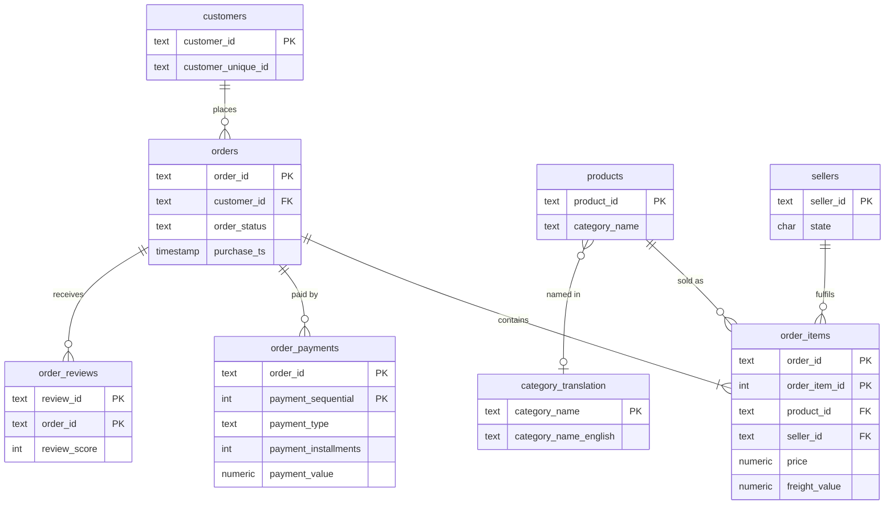

# Order-to-Cash Reconciliation & Revenue Analytics (PostgreSQL)

An end-to-end SQL project on **~100,000 real e-commerce orders** (Olist, Brazil). It loads raw CSVs,
cleans and models them in PostgreSQL, audits data quality, **reconciles what customers paid against what
their orders were worth**, and answers business questions with window functions. It ends with measured
query tuning.

## Business questions

1. Can we trust the data? (duplicates, impossible dates, missing links)
2. For every order, does the amount **paid** equal the amount **owed** (items + freight)? Where they differ, how much money is involved and what is the likely cause?
3. How does revenue trend, which categories and sellers drive it, and how concentrated is it?
4. Which customers are valuable, at risk or lapsed (RFM), and do they come back (cohorts)?
5. Does late delivery hurt customer satisfaction?

## Tech

PostgreSQL 16 | SQL (CTEs, window functions, materialized views, constraints, `EXPLAIN ANALYZE`) | Docker Compose

## Quick start

```bash
# 1. Put the 9 Olist CSVs in ./data  (see data/README.md)
# 2. Run everything (needs Docker)
./scripts/run_all.sh            # add --tuning to include the index benchmark
```

Outputs of each step are saved to `results/`. On Windows use Git Bash or WSL for the script, or run the
`sql/*.sql` files in order with `psql` yourself. Connect at `localhost:5433`, user/password `postgres`, database `olist`.

No dataset yet? `python3 scripts/generate_sample_data.py` then `DATA_DIR=./data_sample ./scripts/run_all.sh`
checks the pipeline on **synthetic** data (do not publish those results).

## Pipeline

| Step | File | What it does |
|---|---|---|
| 1 | `sql/01_schema.sql` | Schemas `staging`, `core`, `recon`, `dq`; raw TEXT tables; typed tables with PK/FK/CHECK constraints |
| 2 | `sql/02_load_staging.sql` | Loads 9 CSVs with `\copy`; prints row counts |
| 3 | `sql/03_build_core.sql` | Casts, trims, removes exact duplicates; every change logged in `dq.cleaning_log` |
| 4 | `sql/04_data_quality_checks.sql` | 28 checks logged to `dq.issues` with severity and % affected |
| 5 | `sql/05_reconciliation.sql` | Order-level payment reconciliation + 6 summary reports |
| 6 | `sql/06_analytics.sql` | Revenue trend, categories, RFM, cohorts, seller Pareto, delivery vs reviews |
| 7 | `sql/07_performance_tuning.sql` | Before/after `EXPLAIN ANALYZE` with indexes |

## Data model



Design notes: `customer_id` is unique **per order**; the real person is `customer_unique_id`, which the RFM and
cohort queries use. `review_id` is reused across orders in the source, so the review key is `(review_id, order_id)`.
The category translation table is joined with `LEFT JOIN` because a few categories have no translation.

## Reconciliation method

```
expected_value = SUM(price + freight_value)   per order   (core.order_items)
paid_value     = SUM(payment_value)           per order   (core.order_payments)
variance       = paid_value - expected_value
```

| Status | Rule |
|---|---|
| MATCHED | `abs(variance) <= 0.01` (rounding tolerance) |
| OVERPAID / UNDERPAID | customer paid more / less than expected |
| NO_PAYMENT | items exist, no payment record |
| PAYMENT_NO_ITEMS | payment exists, no items |
| EMPTY_ORDER | neither |

`probable_cause` is a **rule-based heuristic** to prioritise investigation, not proof. For example, an
overpaid card order with more than one instalment is labelled *likely instalment interest*; I have not verified
Olist's interest policy, so treat that label as a hypothesis. Amounts stay in **BRL**; no currency conversion.

Integrity guard: the script checks that the reconciliation has exactly one row per order.

## Results

**Data quality** (from `dq.issues`, 28 checks)
- 775 orders (0.78%) have payments but no line items, the highest-severity finding.
- 166 orders (0.17% of orders with a carrier date) were handed to the carrier before the purchase timestamp; 8 delivered orders (0.008%) have no delivery date.
- No duplicate keys, no orphan records and no missing purchase timestamps. The core build removed 0 rows because the source keys were already clean.
- Reference data gaps: 610 products (1.85%) have no category, and 13 have no English translation.

**Reconciliation** (99,441 orders, about BRL 15.8M expected value)
- 98.91% of orders (98,362) matched within BRL 0.01.
- 1,079 exceptions: net variance +BRL 165,319.55, gross absolute variance BRL 166,004.63.
- The largest cause is payments on cancelled or unavailable orders with no items: 767 orders, BRL 161,676.89, about 97% of the gross variance. Refund status is not in the dataset, so this shows payment records without items, not proven lost money.
- Smaller items: 264 overpaid orders (+BRL 3,070.14), 39 underpaid (-BRL 199.08), 8 paid orders with no items in other statuses (BRL 915.06), and 1 order with no payment record (BRL 143.46).

**Business insights** (delivered orders, item price only, BRL)
- Revenue was about BRL 13.2M from Sep 2016 to Aug 2018. Monthly revenue grew about 3.5x from Feb 2017 (BRL 234K) to Feb 2018 (BRL 826K), peaked in Nov 2017 (BRL 988K), then flattened at about BRL 0.84M to 0.98M a month in Mar to Aug 2018. The latest months may be undercounted.
- The top 3 categories (health_beauty, watches_gifts, bed_bath_table) make 25.9% of revenue.
- 533 of 2,970 sellers (17.95%) generate 80% of revenue. The largest single seller holds 1.72%.
- Repeat buying is rare: no observed cohort-month exceeds 1% retention (peak 0.72% at month 1), and the "Loyal repeat" RFM segment is 1.93% of customers (3.71% of spend).
- Late delivery hurts reviews sharply: the average score is 4.30 for orders delivered 3+ days early and 1.73 for orders 8+ days late. The share of low scores (2 or below) rises from 9.07% to 78.32%. This is an association, not proof of cause.

**Recommendations** (suggestions based on the findings above)
1. Prioritise preventing deliveries more than 3 days late, where satisfaction drops most.
2. Investigate the 8 paid orders with no items in non-cancelled statuses and the 767 cancelled or unavailable ones with payments, and confirm refund status with the payments team.
3. Focus growth effort on first-order experience and acquisition, since monthly retention stays under 1%.

## Performance tuning

| Query | Before | After | Change |
|---|---|---|---|
| 1. Review score by month (date window + join) | 72.0 ms, Seq Scan on orders | 41.8 ms, Bitmap Index Scan on purchase date | about 42% faster |
| 2. Revenue for one seller | 15.8 ms, Seq Scan | 2.6 ms, Bitmap Index Scan | about 6x faster |
| 3. Orders for one customer | 10.0 ms, Seq Scan | 0.57 ms, Index Scan | about 18x faster |

Timings are single runs on a laptop and will vary. PostgreSQL does not index foreign-key columns automatically,
and the review primary key starts with `review_id`, so it cannot serve a lookup by `order_id`. For Query 1 the
planner still scanned the reviews table because the join needs about 20% of its rows; only the purchase-date
index changed that plan.

## Limitations (stated honestly)

- Historical marketplace data, not a live finance system, and the true payment rules are not documented in the dataset.
- Reconciliation "causes" are heuristics. Reviews are self-selected. The dataset spans only 2016 to 2018.
- Monthly figures at the start and end of the period cover partial months.

## Skills demonstrated

Relational modelling and constraints | ETL in pure SQL | data-quality auditing | reconciliation logic |
CTEs and window functions (`LAG`, `NTILE`, `RANK`, running totals) | conditional aggregation | materialized views |
`EXPLAIN ANALYZE` and indexing | reproducible setup with Docker | documentation.

Data: Olist Brazilian E-Commerce Public Dataset (Kaggle). Not affiliated with Olist.
